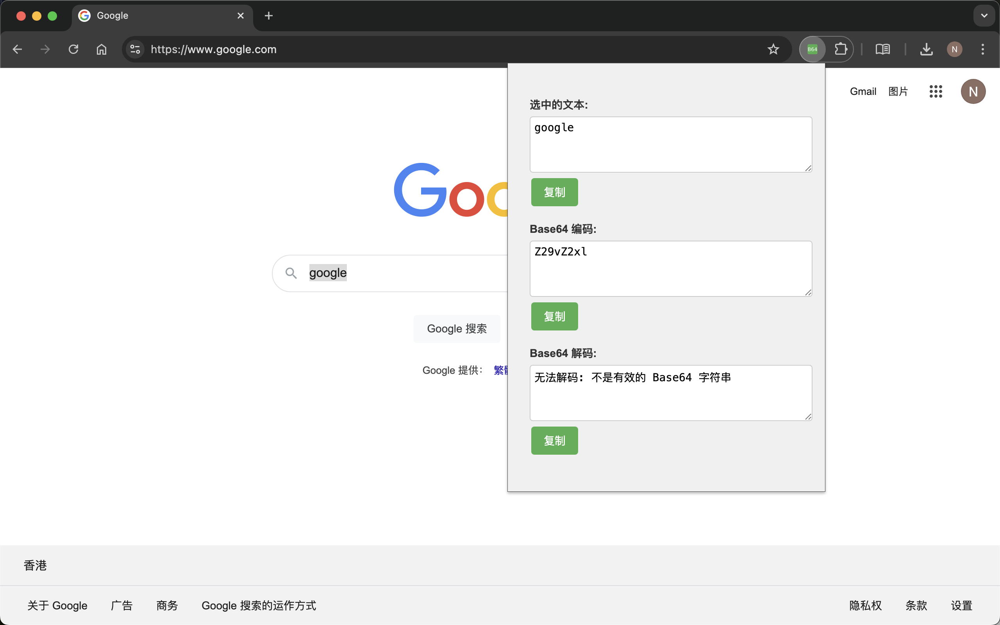
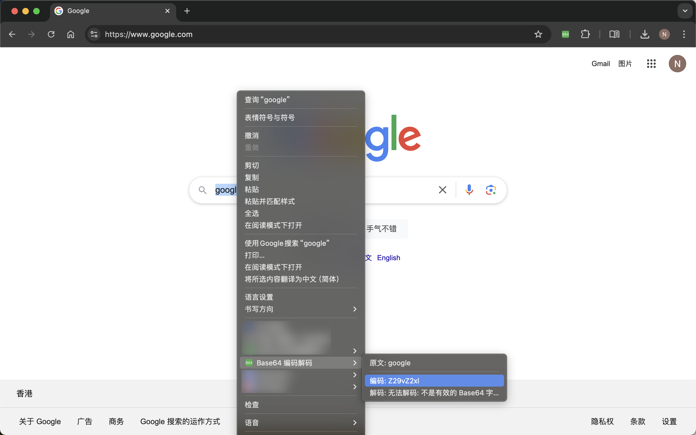

# Base64 编码解码 Chrome 扩展

这是一个简单而功能强大的 Chrome 扩展，允许用户快速进行 Base64 编码和解码操作。它不仅可以处理选中的网页文本，还提供了一个交互式界面用于自定义输入。

## 运行截图

popup 弹窗：



右键菜单：



## 功能特点

1. 右键菜单集成
   - 选择网页上的文本，右击可以直接查看其 Base64 编码和解码结果
   - 点击菜单项可以直接复制编码或解码结果

2. 弹出窗口功能
   - 显示最近选中文本的编码和解码结果
   - 提供实时编码和解码功能，用户可以输入自定义文本
   - 所有结果都配有快捷复制按钮

3. 用户友好的界面
   - 紧凑的布局设计，信息一目了然
   - 实时更新的编码和解码结果
   - 视觉反馈的复制操作

## 安装说明

1. 下载本仓库的 ZIP 文件或克隆到本地
2. 打开 Chrome 浏览器，进入 `chrome://extensions/`
3. 在右上角启用"开发者模式"
4. 点击"加载已解压的扩展程序"
5. 选择包含这些文件的目录

## 使用方法

1. 选中文本处理：
   - 在任何网页上选择一段文本
   - 右击选中的文本，在菜单中选择 "Base64 编码解码"
   - 查看编码和解码结果，点击可直接复制

2. 使用弹出窗口：
   - 点击 Chrome 工具栏中的扩展图标
   - 查看最近选中文本的编码和解码结果
   - 在"原文"文本框中输入或粘贴文本，查看实时编码和解码结果
   - 使用"复制"按钮快速复制任何结果

## 文件结构

```
│
├── src/
│ ├── background/
│ │ └── background.js # 后台脚本，处理右键菜单和消息传递
│ ├── content/
│ │ └── content.js # 内容脚本，处理页面上的文本选择
│ ├── popup/
│ │ ├── popup.html # 弹出窗口的 HTML 结构
│ │ ├── popup.js # 弹出窗口的 JavaScript 逻辑
│ │ └── popup.css # 弹出窗口的样式
│ └── icons/
│ └── ... # 各种尺寸的扩展图标
│
├── manifest.json # 扩展的配置文件
└── README.md # 本文档
```

## 开发说明

- 本扩展使用 Manifest V3 开发
- 使用了 Chrome 扩展 API，包括 storage、contextMenus 和 runtime
- 代码结构清晰，易于理解和扩展

## 注意事项

- 确保您的 Chrome 浏览器版本支持 Manifest V3
- 处理大量文本时可能会有性能影响，请谨慎使用

## 贡献

欢迎提出问题、建议或直接贡献代码。请遵循以下步骤：

1. Fork 本仓库
2. 创建您的特性分支 (`git checkout -b feature/AmazingFeature`)
3. 提交您的更改 (`git commit -m 'Add some AmazingFeature'`)
4. 推送到分支 (`git push origin feature/AmazingFeature`)
5. 开启一个 Pull Request

## 许可

本项目采用 MIT 许可证。

## 联系方式

如果您有任何问题或建议，请通过以下方式联系我们：

- 项目 Issues 页面

感谢您使用我们的 Base64 编码解码 Chrome 扩展！
